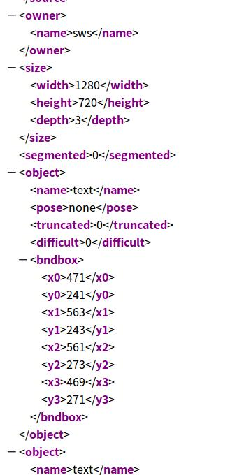

# Convert_Dataset

## 先运行Convert_ICDAR2015_to_VOC_1.py
```
cd Convert_Dataset/
python Convert_ICDAR2015_to_VOC_1.py
```  
* Convert_ICDAR2015_to_VOC_1.py的主要作用是将原ICDAR2015的格式转成预处理格式 主要是将每个框的四个顶点坐标提取出来

## 再运行Convert_ICDAR2015_to_VOC_2.py
```
cd Convert_Dataset/
python Convert_ICDAR2015_to_VOC_2.py
```  
* Convert_ICDAR2O15_to_VOC_2.py将预处理的四个顶点坐标转换成VOC_train格式，主要体现在xml中，详看voc_sample.xml


